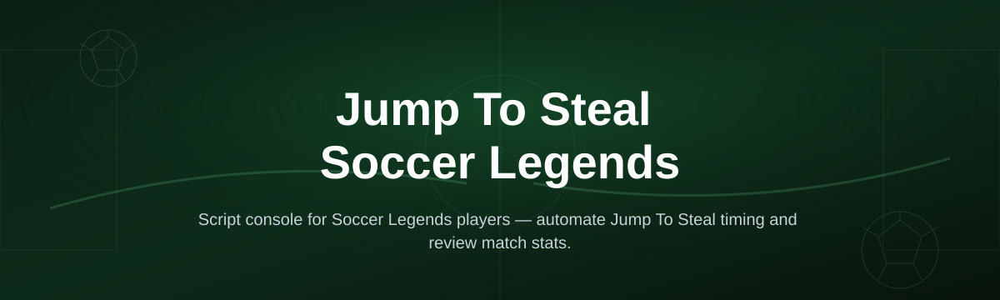
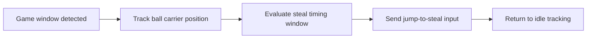

# soccer-legends-script-console

*A focused console for running the Jump To Steal Soccer Legends script without digging through forum threads for outdated builds.*

## What this is

Soccer Legends players who search for a "Jump To Steal" script are usually trying to solve one specific problem: the timing window for intercepting a dribbler is tight, and manual inputs rarely land consistently across different match speeds. **soccer-legends-script-console** is a standalone Windows console built around that one mechanic — it reads the moment to commit to a jump-steal and executes the input on your behalf, so the timing stays consistent whether you're playing a quick friendly or a ranked match.

The console is not a general game trainer and doesn't try to modify dozens of unrelated systems. It focuses on the jump-to-steal interaction, exposes a small set of adjustable parameters (sensitivity, delay offset, target lock behavior), and runs as a lightweight overlay you start before launching Soccer Legends. Everything is local — no account linking, no server communication beyond the initial download.

  

The button opens the project's landing page, where the current build is available for download.

## Who it is for

- Soccer Legends players who lose 1v1 duels because manual steal timing is inconsistent
- Controller and keyboard players who want the same jump-steal window regardless of input method
- Casual players returning after a break who need a faster way to relearn timing-sensitive mechanics
- Content creators recording clips who want repeatable, clean steal sequences
- Anyone comparing older forum-shared scripts and looking for a version that's still maintained in 2026

## What you can do

- **Trigger jump-to-steal on a tunable timing window** instead of relying on manual reflex alone
- **Adjust delay offset** to match your device's input latency
- **Toggle target-lock assist** so the steal attempt aims at the nearest ball carrier
- **Save a profile** per input device (keyboard, controller) so settings don't reset between sessions
- **Run a lightweight overlay** that stays out of the way of the game window
- **Switch between conservative and aggressive timing modes** depending on match pace
- **View a live status indicator** showing whether the console is actively listening
- **Disable the script instantly** with a single hotkey without closing the console

## Keyboard shortcuts

| Shortcut | Action |
|---|---|
| `F1` | Enable / disable the jump-to-steal script |
| `F2` | Cycle timing mode (conservative → balanced → aggressive) |
| `F3` | Toggle target-lock assist |
| `F4` | Open the delay offset adjustment panel |
| `F5` | Save current settings as active profile |
| `F9` | Show / hide the on-screen status overlay |
| `Esc` | Close the console window |

Shortcuts are fixed in the current build; remapping is planned for a future release.

## Getting started

1. Open the landing page using the download button above.
2. Download the current console build for Windows.
3. Extract the folder and run `SoccerLegendsConsole.exe`.
4. Launch Soccer Legends, then bring the console to focus once to confirm it's detecting the game window.
5. Press `F1` to enable the script and start playing.

## Requirements

- Windows 10 or Windows 11 (64-bit)
- Soccer Legends installed and running
- No additional runtime, toolchain, or compiler needed — the console runs as a standalone executable
- Roughly 50 MB of free disk space

## How it works

The console watches a small set of on-screen and input signals while Soccer Legends is running, decides when a jump-to-steal attempt is likely to succeed, and sends the corresponding input at the right moment.

1. On launch, the console locates the active Soccer Legends window.
2. It tracks the ball carrier and your player's proximity in real time.
3. When the timing window for a steal opens, it applies your configured delay offset.
4. The input is sent once per valid window to avoid spamming the action.
5. The console resets to idle tracking immediately after each attempt.

## FAQ

**Does the Jump To Steal script work with a controller or only keyboard?**
Both. The console listens for input events at the OS level, so it works with keyboard, Xbox-style controllers, and most third-party gamepads recognized by Windows.

**Will this get my account banned?**
Any script that automates in-game actions carries some risk under a game's terms of service. Use your own judgment, and consider testing in casual matches before ranked play.

**Why does the steal sometimes still miss?**
Match speed, connection lag, and animation variance all affect timing. Adjusting the delay offset (`F4`) for your specific setup usually improves consistency.

**Can I use this on Mac or mobile?**
Not currently. The console is built and tested for Windows 10/11 only.

**Is there a way to make the timing more aggressive for fast players?**
Yes — cycle timing modes with `F2`. Aggressive mode reduces the safety margin on the steal window, which favors faster reflex play at a slightly higher miss rate.

## Troubleshooting

**Console doesn't detect the game window.**
Make sure Soccer Legends is running in the same display mode (windowed or fullscreen) that was active when you last saved a profile, then restart the console.

**Hotkeys don't respond.**
Some launchers grab keyboard focus. Click once on the Soccer Legends window before pressing `F1`, and confirm no other overlay software is intercepting the same keys.

**Steal timing feels off after a Windows update.**
Input latency can shift slightly after driver updates. Re-run the delay offset adjustment (`F4`) and save a new profile.

**Antivirus flags the executable.**
This is common for unsigned standalone tools. Verify you downloaded from the official landing page linked in this README before deciding whether to allow it.

## License

Released under the [MIT License](LICENSE). This project is provided as-is, without warranty, and is not affiliated with or endorsed by the developers of Soccer Legends. Use it at your own discretion and in line with the game's terms of service.

  

